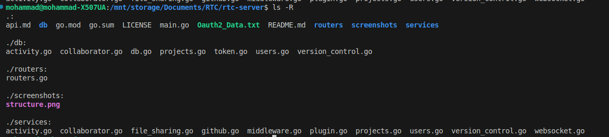
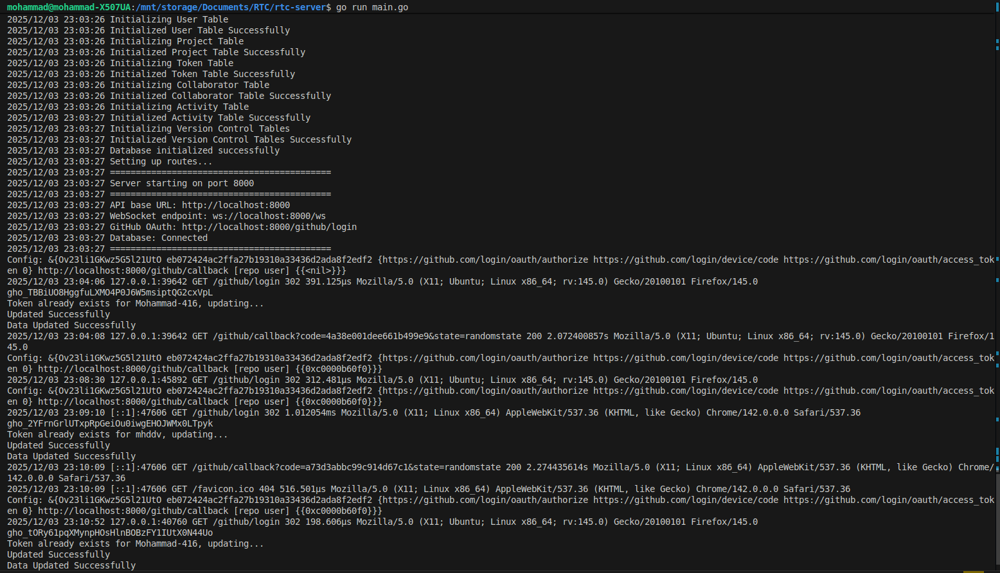
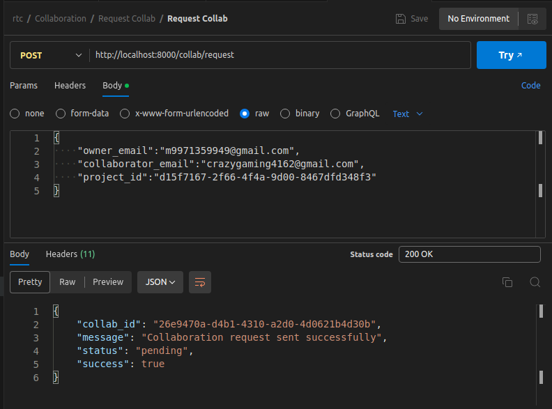

# rtc-server

```rtc-server``` is a backend service that helps manage game/dev projects through GitHub.
It handles login via GitHub, **creates repos** for new projects, and **keeps track** of users and projects in a database.

The idea is to make it easy to spin up a project, invite people, and manage repos without doing everything manually.

## Features

Login with **GitHub OAuth** (session-based)

Automatically create GitHub repos for new projects

Add/remove collaborators on repos

Basic repo actions like push/pull (through server-side GitHub integration using ```libgit2sharp```)

**User CRUD** (create, update, delete)

**Project CRUD** (create, update, delete)

**PostgreSQL** for storing users, projects, and sessions

Middleware for logging, CORS, etc. using ```gorilla/handlers + net/http```

## Tech Stack

**Language**: Go

**Auth**: GitHub OAuth

**Database**: PostgreSQL

**HTTP**: net/http + gorilla/handlers

**Platform**: GitHub API for repos & collaborators

## Project Structure



## Examples





## Upcoming Features

Real-time collaboration with WebSockets

Room-based project sessions

Diff-based sync for scenes/scripts/assets

Better activity logging and history


**This Project is Licensed Under MIT License.**
**github.com/Mohammad-416**
**2025-2026**